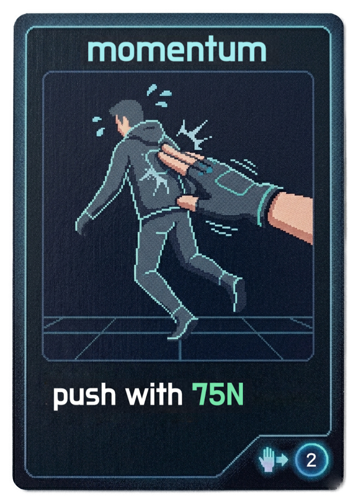

# Physics Card Duel

A local hot-seat PvP card game built with `pygame`, based on the rules from `Physics.docx`.

The mission/purpose of our game:
- intertwine the dull reality of physics with an fun and engaging card game.
- this will help promote high school student who might not find physics intresting an oppertunity to explore this subject which will trigger their future intrest in physics.
- 

The advantage of our game:
- easy access (small app, simple instruction, play immediately)
- simple rules (easy for new-comers to play the game)
- detailed animation/design of the cards and background of this game
## Game Design



## What is in the prototype

- Two players start at `12m` and `14m` on a `25m` stage.
- Each player begins with `5` energy and `2` random cards.
- At the start of each new turn, the active player gains `2` energy and draws `2` cards.
- Players can play any number of effect cards, then one action card.
- Force cards resolve with a short physics simulation using:
  - mass = `50kg`
  - gravity = `10m/s^2`
  - friction starts at `0.2`
  - impact time cap = `2s`
- Direct hits now use action-reaction force:
  - the defender is pushed away
  - the attacker recoils in the opposite direction
- A successful dodge makes the attacker lunge forward instead.
- A player loses by being pushed past `0m` or `25m`.

## Controls

- Click a card to select it.
- Click the selected card again, or press `Space`, to play it.
- Press `Enter`, or click `End Turn`, after the action resolves.
- Press `R` to restart.
- Press `Esc` to quit.

## Run

1. Install dependencies:

```powershell
pip install -r requirements.txt
```

2. Start the game:

```powershell
python main.py
```

## Assumptions used for playability

- Hands are capped at `6` cards so the UI stays readable.
- Conservation of Energy restores `3` energy after `3` of the affected player's turns.
- Friction slows movement after a shove instead of canceling weaker cards completely.
